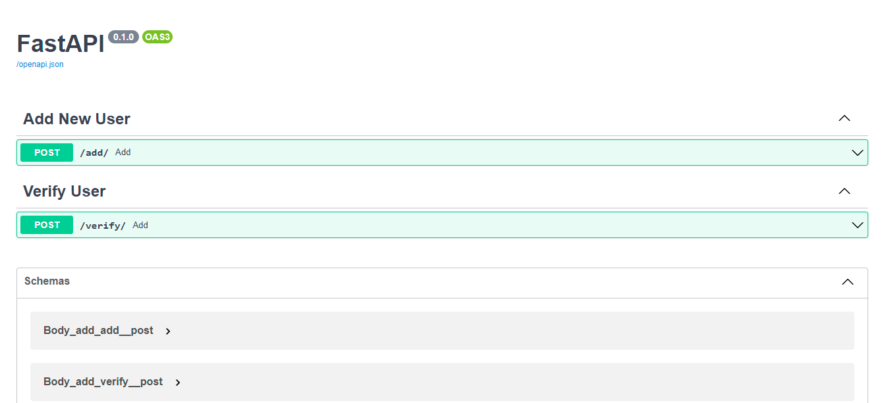

# Dual Authentication
Dual Authentication: Using face-recognition and iris-recognition for more accurate authentication based on FastAPI system.

We using FaceNet model in Deepface for face recognition and daugman algorithm for iris recognition.

* https://github.com/yj7082126/OpenCV_IrisRecognition
* https://github.com/serengil/deepface



## Requirements
* fastapi
* uvicorn
* sqlalchemy
* passlib
* python-multipart
* python-opencv
* deepface
* sklearn


## How to use

First clone this project and go to dual-authentication folder

```shell
git clone git@github.com:mertz1999/Dual-Authentication.git
cd Dual-Authentication
```

Then install requirements packages in requirements.txt file:
```shell
pip install -r requirements.txt
```

for running server you need to start uvicorn:
```bash
uvicorn main:app --reload
``` 

After this you will be see something like this:
```
INFO:     Uvicorn running on http://127.0.0.1:8000 (Press CTRL+C to quit)
INFO:     Started reloader process [9616] using StatReload
INFO:     Started server process [11052]
INFO:     Waiting for application startup.
INFO:     Application startup complete.
```

you got host ip and port to use it. you can use your browser or curl command in shell for use this api.

Adding new user is available on http://127.0.0.1:8000/add and verifying a user is on http://127.0.0.1:8000/verify


#### Note: use http://127.0.0.1:8000/docs for Swagger UI.

